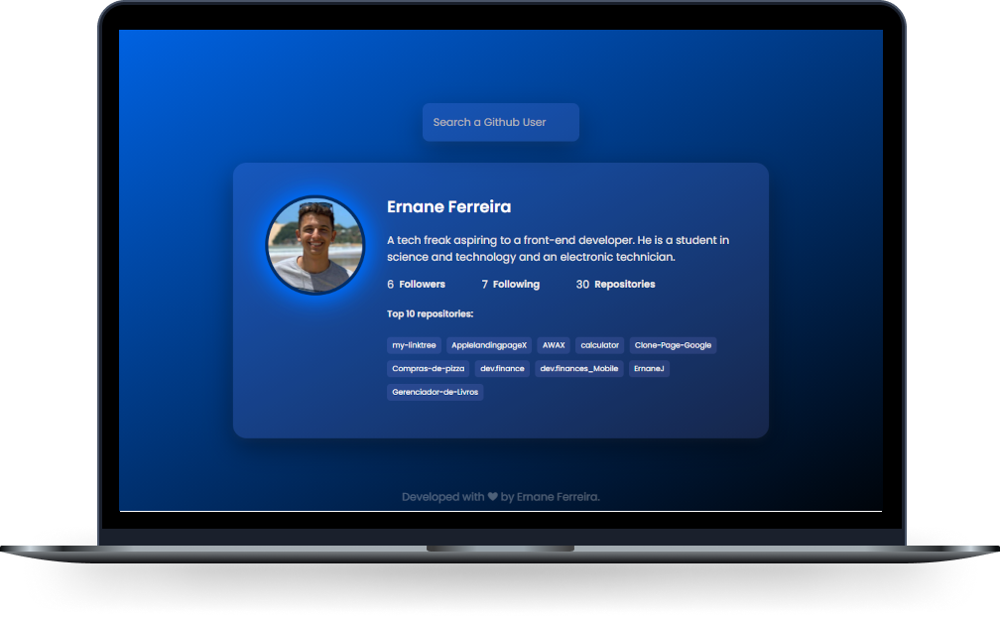

<h1 align="center">
  <strong>Github Profiles </strong>
</h1>

  <a href="#-Technologies">Technologies</a>&nbsp;&nbsp;&nbsp;|&nbsp;&nbsp;&nbsp;
  <a href="#-Project">Project</a>&nbsp;&nbsp;&nbsp;

 

  

## 🚀 Technologies

This application was developed with the following technologies:

- HTML 5
- CSS 3
- JavaScript

## 💻 Project

Using the <a href="https://docs.github.com/en/rest">github API</a>, this single page application was developed to make requests by username and show your main data as: number of repositories, number of followers and who is following, profile image and direct access to the top 10 repositories in your account.

Design based on a <a href="https://www.uidesigndaily.com/posts/photoshop-profile-card-user-day-286">Profile Card</a> from the <a href="https://www.uidesigndaily.com/">Design Daily</a> website.

<a href="https://ernanej.github.io/Github-profiles/">Click here</a> to access the page.

---

Developed with ❤ by <a target="_blank" href="https://ernanej.github.io/my-linktree/">Ernane Ferreira</a>. 👋🏻 
<small>Project developed with a personal and educational focus.<small>

